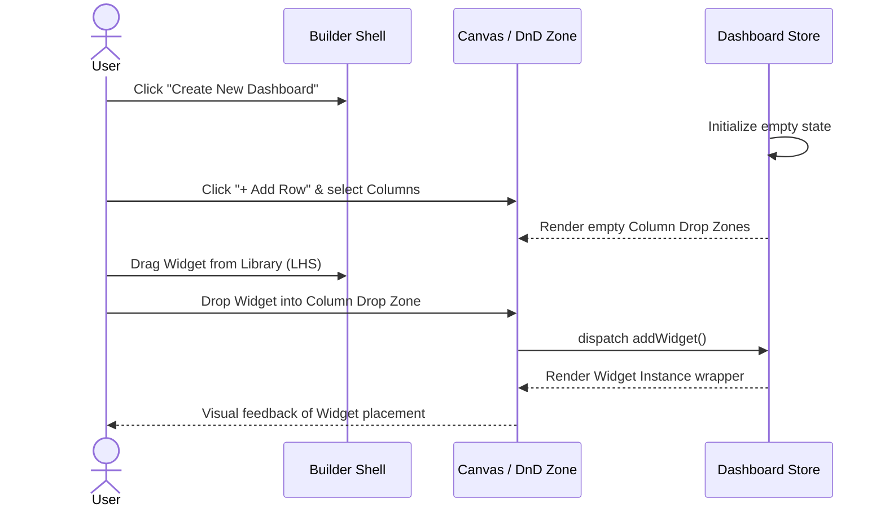
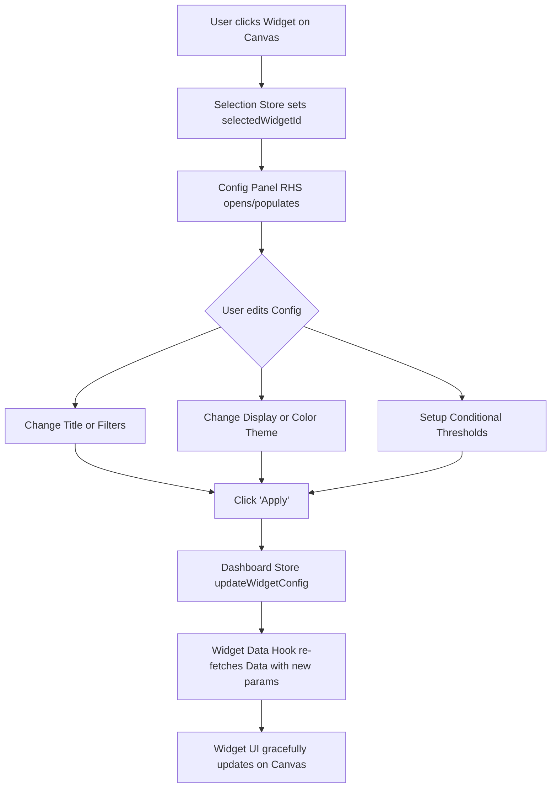
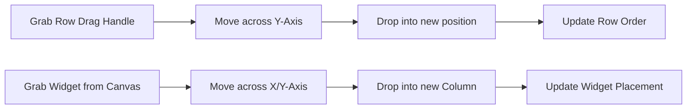

# Product Requirements Document (PRD): Custom Dashboard Builder

## 1. Product Overview
The Custom Dashboard Builder is an interactive, drag-and-drop tool for users to create, configure, and manage custom analytics dashboards. By giving users the capability to assemble personalized views from a registry of widgets (KPIs, charts, and tables), the product aims to enhance data visibility and user autonomy.

## 2. Target Audience
- **Data Analysts:** Needing deep-dive configuration and pivot tools.
- **Operations Managers:** Monitoring key metrics.
- **Executive Stakeholders:** Looking for high-level summaries and trends.
- **Call Center Supervisors:** Monitoring real-time queue health and agent performance (Inferred from widget types like `kpi-calls-handled`, `kpi-aht`).

---

## 3. High-Level UI Layout & Wireframe

The application layout is a responsive 3-panel grid system (Builder Shell).

### ASCI Wireframe Representation
```text
+-----------------------------------------------------------------------------+
|                                  HEADER                                     |
| [Logo]   [          Dashboard Name Editor             ]    [Save] [Preview] |
+-----------------------+-----------------------------------+-----------------+
|                       |                                   |                 |
|  WIDGET LIBRARY       |           CANVAS                  |  CONFIG PANEL   |
|  (Left Hand Side)     |           (Center)                |  (Right Hand    |
|                       |                                   |   Side)         |
|  [Search Input]       |  +-----------------------------+  |  [Widget Title] |
|                       |  | Row 1              [::::]   |  |                 |
|  ▼ KPI Widgets        |  | +--------+ +--------+       |  |  ▼ Filters      |
|  [ Call Volume  ]     |  | |Widget A| |Widget B|       |  |   [Add Filter]  |
|  [ Handle Time  ]     |  | +--------+ +--------+       |  |                 |
|  [ Abandon Rate ]     |  +-----------------------------+  |  ▼ Pivot Section|
|                       |                                   |   [Group By]    |
|  ▼ Charts             |  +-----------------------------+  |                 |
|  [ Outcomes Mix ]     |  | Row 2              [::::]   |  |  ▼ Display      |
|  [ Volume Trend ]     |  | +-------------------------+ |  |   Theme: [v]    |
|                       |  | |        Widget C         | |  |   Format:[v]    |
|  ▼ Tables             |  | +-------------------------+ |  |                 |
|  [ Live Queue   ]     |  +-----------------------------+  |  ▼ Thresholds   |
|                       |                                   |   [Add Rule]    |
|                       |         [+ Add New Row]           |                 |
|                       |                                   |  [ Apply Config]|
+-----------------------+-----------------------------------+-----------------+
```
*Note: Config Panel collapses or slides out depending on the screen size or component selection.*

---

## 4. Key Workflows & User Flows

### Workflow 1: Creating a Dashboard and Adding Widgets


### Workflow 2: Configuring a Widget


### Workflow 3: Reorganizing Layout


---

## 5. Functional Requirements

### 5.1 Presentation Layer (UI Shell)
- **Widget Library (LHS):** Draggable palette of available widgets, categorized into KPIs, Charts, and Tables. Must include search and filtering.
- **Canvas (Center):** 
  - **Rows:** Dynamic sections that can be added, reordered (via drag-and-drop), and collapsed.
  - **Columns:** Rows are divided into columns with adjustable, percentage-based widths.
  - Can accept widgets dropped from the library into column drop zones.
  - Supports moving/swapping widgets between different columns and rows.
- **Config Panel (RHS):** 
  - Conditionally renders when a widget is actively clicked/selected.
  - Controls widget-specific configurations (Title, Filters, Pivot options, Data Display Styles, Color Themes, Conditional Thresholding).

### 5.2 Widget Capabilities
- **KPI Cards:** Highlight single primary values, with context like trend indicators (e.g. ▲ 4.2%) and previous comparisons.
- **Charts:** Visual reporting such as Donut charts (Call Outcomes) or Line charts (Hourly Volume Trend). Must support configuration items like legends and themes.
- **Tables:** Real-time metrics presented cleanly (e.g. Live Queue Snapshot).
- **Data Hooking Capability:** Widgets independently fetch their own data by combining global dashboard filters and scoped widget-level filters.

### 5.3 Workstation & Persistence
- **State Store (Zustand):** Must retain dashboard shape (rows, columns, configs), global filters, state dirtiness, and current theme.
- **Undo/Redo:** Must support an undo/redo stack buffering up to the last 50 actions to forgive user mis-clicks or accidental layout drops.
- **Auto-Save:** Implement an auto-save loop (e.g., debounced save every 5 seconds) after modifications begin.
- **Fallbacks:** Build robust fallback saving to LocalStorage or IndexedDB to prevent data loss if the REST API times out.

---

## 6. Technical & Non-Functional Requirements
- **Fluid Interactions:** Utilize modern drag-and-drop bindings (via `@dnd-kit`) to ensure 60fps performance and accessibility compliance.
- **Large Scale Virtualization:** Use `useVirtualizer` for dashboards exceeding normal row heights to keep DOM nodes low and memory tight.
- **Memoization Strategy:** Implement React `memo` extensively on Row and Widget wrappers so configuring Widget A does not re-render Widgets B-Z.
- **Resilience:** Wrap dashboard environments in dedicated Error Boundaries. If one widget's API call fails spectacularly or has a JS error, it crashes only the widget frame, keeping the rest of the Dashboard usable.

---

## 7. Migration & Release Path

| Phase | Description | Key Deliverables |
| :--- | :--- | :--- |
| **Phase 1: Foundation** | Setup architecture & wireframing | Stores, Widget Registry, Base Shell structure |
| **Phase 2: Core Actions** | Enabling primary builder mechanics | DnD Canvas, Row/Col manipulation, Config Panel RHS |
| **Phase 3: Polish** | Enhanced user experience | Undo/Redo mechanisms, keyboard shortcuts, Auto-saving |
| **Phase 4: Advanced** | Power-user & expansion | Collaborative editing, PDF exporting, custom widget queries |
