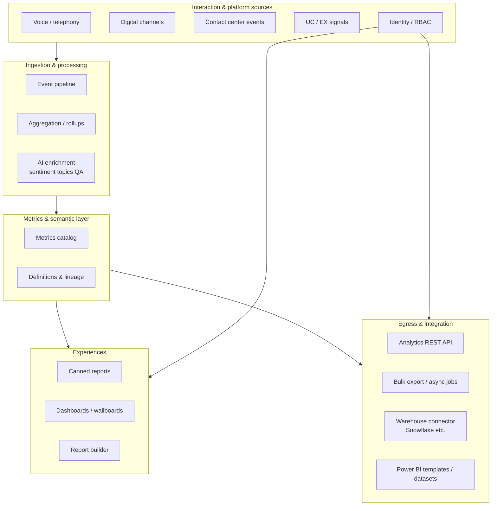
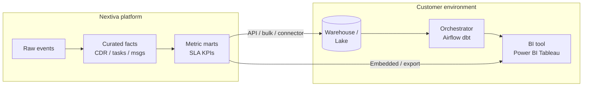
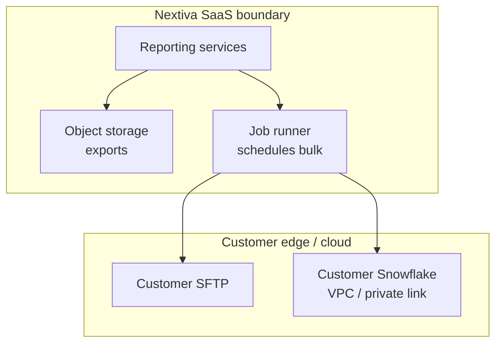
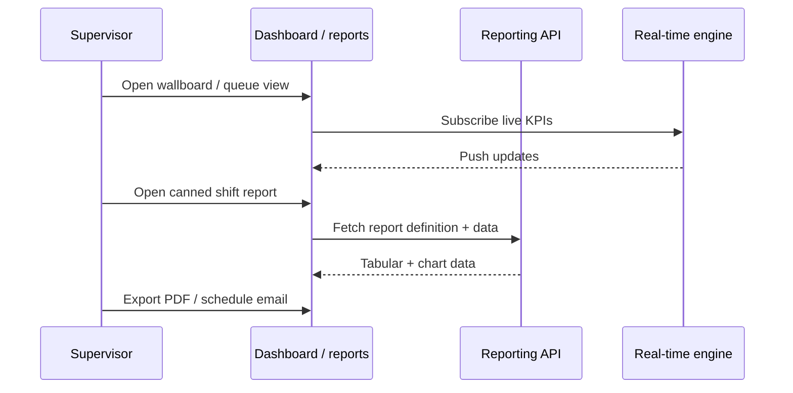
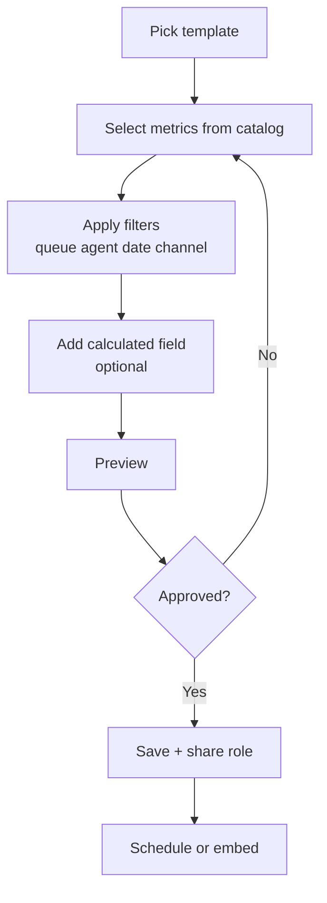
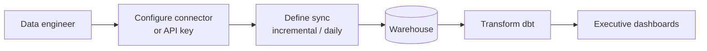
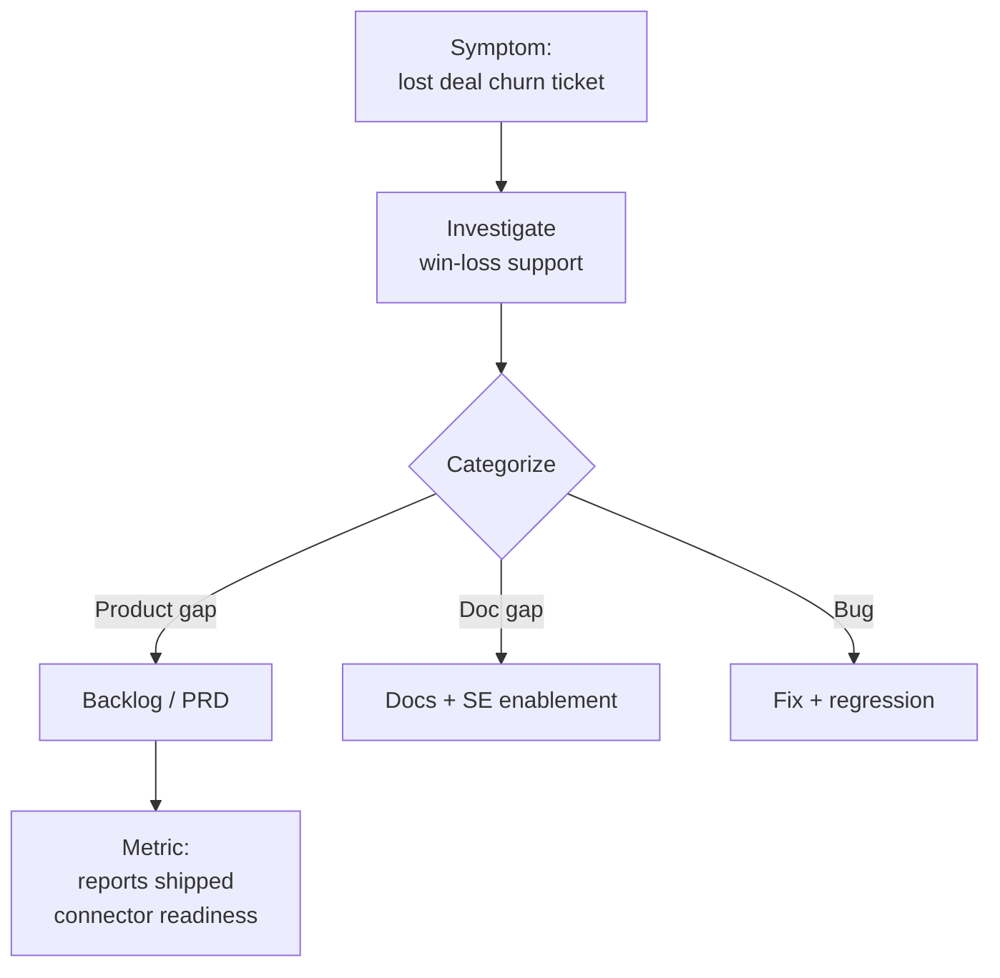
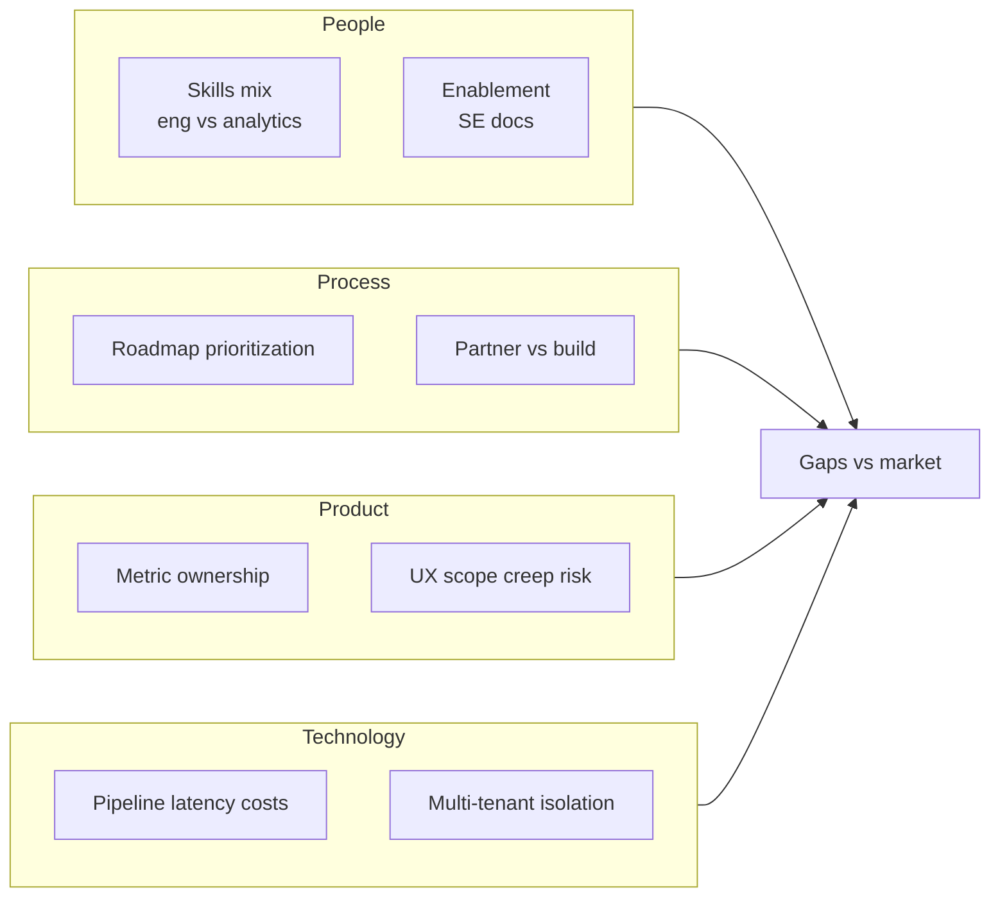
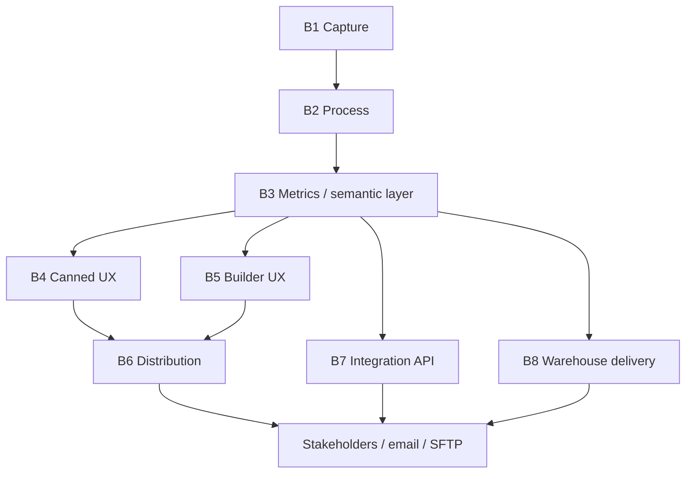

# Strategic Reporting & Analytics — Complete Guide

**Audience:** Product, Engineering, Architecture, GTM, Leadership  
**Scope:** Nextiva ([Nextiva app](https://app.nextiva.io/)) vs. market (Dialpad, RingCentral EX/CX) — canned reports, custom/report builder, API & customer warehouse/BI  
**Version:** 1.0 · March 2026  

---

## Table of contents

1. [Executive summary](#1-executive-summary)  
2. [Strategy & approach](#2-strategy--approach)  
3. [Solution overview](#3-solution-overview)  
4. [Target architecture (diagrams)](#4-target-architecture-diagrams)  
5. [Flows](#5-flows)  
6. [RCA — root cause analysis](#6-rca--root-cause-analysis)  
7. [FBA — features, benefits, attributes](#7-fba--features-benefits--attributes)  
8. [Functional block architecture](#8-functional-block-architecture)  
9. [Phased delivery & roadmap](#9-phased-delivery--roadmap)  
10. [Action items (tracked)](#10-action-items-tracked)  
11. [Competitive snapshot](#11-competitive-snapshot)  
12. [Appendix — how to turn this into a PPT](#12-appendix--how-to-turn-this-into-a-ppt)  

---

## 1. Executive summary

### Strategic thesis

Reporting must be delivered as **three coordinated capabilities** sharing **one metrics layer**:

| Layer | Job to be done |
|--------|----------------|
| **Canned reports & dashboards** | Fast time-to-value; supervisors and ops live here |
| **Custom / report builder** | Self-service; reduces PS and “one-off report” load |
| **API + warehouse + BI** | Enterprise sovereignty; data lands in *their* stack |

Under-investing in any leg creates predictable failure: churn (no self-serve), lost enterprise deals (no egress), or slow adoption (weak defaults).

### Market signal

| Signal | Implication |
|--------|-------------|
| Contact center analytics market growing (~20% CAGR class) | Reporting is a **buying criterion**, not a checkbox |
| MultiCaaS (UCaaS + CCaaS) bundling | **Unified EX + CX** analytics is table stakes |
| Competitors emphasize scale (250+ reports, 350+ metrics) and AI (sentiment, auto-CSAT) | Parity + differentiation both require a deliberate roadmap |

### Position vs. competitors (summary)

- **RingCentral:** Strength in **breadth** (pre-built library, many metrics).  
- **Dialpad:** Strength in **operational AI** (sentiment, live floor insight).  
- **Nextiva:** Solid **core** (reports, scheduling, Power BI export, queries); gaps in **AI canned insights**, **visual builder**, **native warehouse connectors**, **export retention / streaming**.

---

## 2. Strategy & approach

### Strategic pillars

1. **Trustworthy metrics** — Same definition in UI, exports, and API (avoid “two truths”).  
2. **Progressive disclosure** — Canned → customize → warehouse; meet each persona where they are.  
3. **Enterprise egress first-class** — Retention, formats, connectors, SLAs for pipelines.  
4. **Constrained BI** — Rich **operational** analytics in-product; deep **modeling** in customer BI (Power BI, Tableau, etc.).

### Approach (how we execute)

| Phase | Focus | Outcome |
|-------|--------|---------|
| **Foundation** | Expand canned library, retention, schema docs | Fewer sales blockers; compliance-ready exports |
| **Parity** | Flagship connector (e.g. Snowflake), AI insight reports, API hardening | Enterprise-ready narratives |
| **Differentiation** | Visual builder, large metric library, unified EX+CX views | Self-service at scale |
| **Platform** | Streaming/event API, more connectors, predictive use cases | Stickiness in customer data estate |

### Principles

- Do **not** rebuild Tableau; **integrate** with it.  
- **AI** compresses time-to-insight; it does **not** replace auditable facts and exports.  
- **RBAC** and **audit** are part of MVP for enterprise segments.

---

## 3. Solution overview

### Solution components

| Component | Description | Primary users |
|-----------|-------------|----------------|
| **Report catalog** | Curated canned reports by domain (agent, queue, campaign, quality, EX/CX) | Supervisors, managers |
| **Dashboards / wallboards** | Real-time operational views | Ops, WFM |
| **Report builder** | Visual or guided builder over a **metrics catalog** + templates | Analysts, admins |
| **Scheduling & distribution** | Email, SFTP, secure download | IT, admins |
| **Export service** | CSV/JSON/Parquet (target), long retention, encryption | Data teams |
| **Integration layer** | REST + (target) bulk/stream; webhooks | Developers, partners |
| **Warehouse delivery** | Native or partner connectors to Snowflake / lakehouse patterns | Enterprise IT |

### “North star” experience

- Day 1: **Install base** gets value from canned reports without training.  
- Day 30: **Power users** clone templates and schedule.  
- Day 90: **Enterprise** runs dbt/BI on a **stable contract** from API/warehouse feeds.

---

## 4. Target architecture (diagrams)

*Diagrams use [Mermaid](https://mermaid.js.org/). Render in VS Code, GitHub, Notion, or export to PNG via Mermaid Live Editor.*

### 4.1 High-level logical architecture

### 4.2 Data flow — from interaction to customer BI

### 4.3 Deployment view (conceptual)

---

## 5. Flows

### 5.1 Supervisor — daily operations (canned + real-time)

### 5.2 Analyst — custom report (target state)

### 5.3 Data engineer — warehouse pipeline

### 5.4 RCA workflow (process tie-in)

---

## 6. RCA — root cause analysis

### 6.1 Problem statement (symptoms)

| Symptom | Observable evidence |
|---------|---------------------|
| Enterprise **pushback** on analytics | RFPs ask for warehouse path, long retention, metric catalogs |
| **Services-heavy** custom reporting | Customers depend on queries vs. self-serve builder |
| **Competitive** “AI insights” narrative | Dialpad / RingCentral lead messaging on sentiment / auto-CSAT |
| **Integration friction** | Short export windows, limited native connectors vs. Stitch/Domo patterns |

### 6.2 Root causes (not just symptoms)

| # | Root cause | Why it matters |
|---|------------|----------------|
| RC1 | **Semantic layer immaturity** — metrics not fully unified across UI, export, API | “Numbers don’t match” → distrust → warehouse bypass or churn |
| RC2 | **Persona coverage gap** — strong ops, weaker **analyst** and **data engineer** journeys | Builder and egress under-owned vs. competitors |
| RC3 | **AI insights not productized** as **canned** packages | Harder demo; weaker “day 1 wow” |
| RC4 | **Egress treated as secondary** — retention, formats, connectors | Blocks regulated and enterprise buyers |
| RC5 | **EX + CX silos** in analytics experience | Misaligned with MultiCaaS positioning |

### 6.3 Contributing factors (fishbone summary)

### 6.4 Corrective & preventive actions (linked to roadmap)

| Root cause | Corrective action | Preventive action |
|------------|-------------------|-------------------|
| RC1 | Ship **metrics catalog** + contract tests UI vs API | Definition owners per metric; CI on drift |
| RC2 | **Builder MVP** + **API reference** + templates | Persona-based KPIs in PRD |
| RC3 | **AI canned** report packs (sentiment, topics, QA) | Evaluate models with audit trail |
| RC4 | **90d+ retention**, Parquet/JSON, **Snowflake** path | SLOs for export success |
| RC5 | **Unified** EX+CX dashboard templates | Single navigation model |

---

## 7. FBA — features, benefits, attributes

*FBA here = **Features** (what we ship), **Benefits** (customer outcome), **Attributes** (measurable / quality properties).*

### 7.1 Canned reports

| Feature (what) | Benefit (why) | Attributes (how we measure) |
|----------------|---------------|------------------------------|
| Expanded report library by domain | Faster TTV; fewer blank-slate moments | # catalog reports; activation in 30 days |
| AI-assisted canned packs (sentiment, topics) | Supervisors spot issues without manual QA 100% | Time to first insight; adoption of packs |
| Unified EX + CX templates | One story for MultiCaaS buyers | Cross-domain report usage |
| Role-based report access | Security and compliance | RBAC coverage; audit events |

### 7.2 Custom report builder

| Feature | Benefit | Attributes |
|---------|---------|------------|
| Template clone + save | Less PS; repeatable configs | % reports from templates |
| Drag-drop or guided metric picker | Analyst self-service | Median time to first custom report |
| Calculated fields | Custom KPIs without SQL | # active calculated metrics |
| Schedule + multi-format export | Fits existing workflows | Schedule success rate; export volume |

### 7.3 API, warehouse, BI

| Feature | Benefit | Attributes |
|---------|---------|------------|
| Documented analytics API | Customer-owned pipelines | API uptime; p95 latency |
| Bulk / async export | Large historical backfills | Job success %; max rows / job |
| Native warehouse connector | IT-standard landing zone | # enterprises on connector; data freshness SLA |
| Longer retention window | Audit and reconciliation | Max retention offered; restore success |

---

## 8. Functional block architecture

*Functional blocks map capabilities to ownership and dependencies.*

| Block | Responsibility | Depends on |
|-------|----------------|------------|
| **B1 — Data capture** | Events, CDRs, tasks, media metadata | Platform telemetry |
| **B2 — Processing** | Aggregations, sessions, attribution | Stream/batch jobs |
| **B3 — Semantic / metrics** | Definitions, dimensions, RBAC filters | B2, identity |
| **B4 — Canned UX** | Catalog, run, export | B3 |
| **B5 — Builder UX** | Composer, templates, sharing | B3 |
| **B6 — Distribution** | Email, SFTP, download | B4, B5 |
| **B7 — Integration** | API keys, quotas, webhooks | B3 |
| **B8 — Warehouse delivery** | Connector, sync state, encryption | B3, customer infra |

*Use the table in §8 as the canonical functional map; the diagram shows dependency flow.*

---

## 9. Phased delivery & roadmap

| Phase | Timeframe (indicative) | Deliverables | Success criteria |
|-------|-------------------------|--------------|------------------|
| **P1 Foundation** | 0–2 quarters | +canned depth; retention ↑; metric glossary v1; export reliability | Fewer “missing report” losses; audit-friendly retention |
| **P2 Parity** | 1–3 quarters | Snowflake (or top warehouse) MVP; AI canned packs; API hardening | Enterprise pilot wins; connector adoption |
| **P3 Differentiation** | 2–4 quarters | Visual builder MVP; 300+ class metric library; unified EX+CX | Self-serve %; PS hours down |
| **P4 Platform** | 3+ quarters | Streaming/event exports; more connectors; selective predictive | Pipeline stickiness; NRR uplift |

*Calendar quarters are placeholders — align to your fiscal planning.*

---

## 10. Action items (tracked)

| ID | Action | Owner (suggested) | Priority | Dependency | Status |
|----|--------|-------------------|----------|--------------|--------|
| A1 | Publish **metrics catalog** v0 (definitions + owners) | Analytics PM + Eng | P0 | None | Not started |
| A2 | Win/loss synthesis: top 10 reporting objections | PM + Sales | P0 | CRM data | Not started |
| A3 | **Canned report** gap list vs RingCentral/Dialpad categories | PM + Design | P0 | A2 | Not started |
| A4 | Export **retention** policy proposal (target 90d+) | Eng + Security | P0 | Compliance review | Not started |
| A5 | **Snowflake** (or #1 warehouse) connector — PRD + TAM | PM + Arch | P0 | A1 | Not started |
| A6 | **AI canned** pack scope (sentiment/topics) — feasibility + risk | PM + ML + Legal | P1 | Privacy review | Not started |
| A7 | **Report builder** UX concept + MVP slice | Design + PM | P1 | A1 | Not started |
| A8 | **API** public reference + SLA draft | Eng + DevRel | P1 | None | Not started |
| A9 | **Unified EX+CX** dashboard templates — IA workshop | PM + UX | P1 | Product strategy | Not started |
| A10 | SE training: “how to demo + answer warehouse questions” | Enablement | P1 | A5 A8 | Not started |

*Replace owners with actual names; track status in Jira/ADO.*

---

## 11. Competitive snapshot

| Capability | Dialpad | RingCentral | Nextiva (direction) |
|------------|---------|-------------|---------------------|
| Pre-built depth | Strong ops + AI story | Very large library | **Expand + package by industry** |
| Custom builder | Saved views / flexible UI | Large metric set | **Visual builder + catalog** |
| AI canned | Sentiment / floor insight | Auto-CSAT / interaction analytics | **Ship packaged AI reports** |
| API / BI | Stats API; partner connectors | Analytics API; ecosystem | **Harden API + warehouse MVP** |
| Warehouse | Domo, Theta Lake, etc. | Stitch, cloud warehouses | **Native flagship connector** |

---

## 12. Appendix — how to turn this into a PPT

1. **Manual (fast):** Use companion file `strategic-reporting-powerpoint-outline.md` — each `## Slide` → one PowerPoint slide.  
2. **Diagrams:** Copy Mermaid into [Mermaid Live Editor](https://mermaid.live) → export PNG → paste on slides.  
3. **Automated:** Install [Pandoc](https://pandoc.org/) and run `pandoc -o deck.pptx strategic-reporting-powerpoint-outline.md` (results vary by format).  
4. **Google Slides:** Import outline or paste sections per slide.

---

## Document history

| Version | Date | Notes |
|---------|------|--------|
| 1.0 | 2026-03-23 | Consolidated strategy, architecture, flows, RCA, FBA, actions |

---

*Related files in repo:* `strategic-reporting-analysis.md`, `strategic-reporting-ppt-slides.md` *(older splits; this guide is the single source of truth going forward).*
